 
  

	 	  	  
### A little about me...   
    A passionate developer, currently working as Software Engineer

  
###  ⚙️ Some Tool and Tech I use:     
                                  
	
 
	  
 

  

  

  
 ## 📫 How to reach me?

<!--  -->
   
